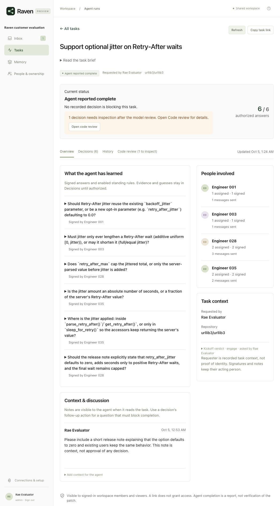

# A new customer loop, 5 October 2026

The supervised loop worked: a real Claude Code host discovered five decisions, received six signed answers after a required follow-up, implemented a urllib3 feature, received Raven's saved reviews, and finished. A fresh host recovered the task using its client key. The final patch passed 874 checks, including 22 independent checks written before the coding host started; 53 upstream checks were skipped.

This was not an uninterrupted success. Testing found conversation failures, a misleading model review, and a duplicate item in the task view. The fixes and their retests are described below. Inference and routing still have limits.

## What was real

The starting Raven revision was `the preview snapshot`. Installation used a fresh public Raven checkout, the actual `./setup` entry point, an empty Docker volume, PostgreSQL 17 and a separate urllib3 checkout at `ed0ed075c6b93f7c515ebd3abe9a7248507ef8c5`. The public upstream was reachable during the run. The frozen revision makes the experiment repeatable; it was not represented as urllib3's current head.

Both the coding host and Raven used real Anthropic inference. The host received the task below, its MCP connection, repository identity and test interpreter. It received no decision list, owner names, answer key or file paths. It guessed relevant paths itself on its first tool call, then inspected the checkout.

> Support optional jitter on Retry-After waits so a fleet does not retry simultaneously. Keep existing behavior by default and preserve server-requested delays and configured limits. Investigate the policy choices, implement the change and add regression tests.

Slack was simulated, as requested. A local Web API supplied 72 synthetic contacts linked by email to public commit identities from 500 commits. These are test people, not statements by urllib3's maintainers. No actual maintainers were contacted and no actual maintainer authority was established. The simulation used Slack's documented [directory response](https://docs.slack.dev/reference/methods/users.list/), [message posting response](https://docs.slack.dev/reference/methods/chat.postMessage/), [DM event envelope](https://docs.slack.dev/reference/events/message.im/) and [search response](https://docs.slack.dev/reference/methods/assistant.search.context/). Replies entered through signed HTTP callbacks, not direct calls to answer functions.

No ownership map was supplied. Two knowledge associations were learned automatically during answers; they were not manual ownership grants. Recipients had no Raven passwords. One optional operator account was created for the browser checks. Workspace naming and login were exercised through computer use; the disposable profile was provisioned through its HTTP form endpoint.

## What happened at each step

| Step | Observed result | Limit or friction |
| --- | --- | --- |
| Install and connect | Docker became healthy, local history was indexed, Slack directory paging imported 72 contacts, and the real host connected over HTTP MCP. | Actual Slack installation, permission grants and public callback delivery were not tested. |
| Kickoff and discovery | Raven engaged. The host asked about parameter shape, distribution, the cap, units and where jitter belongs. | This demonstrates one host discovering this task's questions, not complete decision coverage for arbitrary work. |
| First contact | Questions reached contacts inferred from history, with reasons identifying the relevant contribution. | The compatibility question needed a referral. History finds plausible contacts, not guaranteed decision makers. |
| Conversation | A context question got a useful explanation. A referral reached the next person after confirmation. An answer amendment preserved the earlier requirements. “OK” did not sign. | Search initially swallowed a polite referral; clear instructions and explicit agreement also caused unnecessary clarification. These cases were corrected and retested. |
| Authorization | Finish was refused while five decisions remained unsigned. Duplicate confirmation applied once. The pending answer survived a container restart. | Raven gates recorded decisions; it does not control a separate agent's ability to ship code. |
| Optional web view | Computer use covered setup, login, connections, task overview, a stakeholder note, a required follow-up, history and saved review. The agent adopted the follow-up and read the note. | Initial messages are verbose, and History contains several operational events per decision. |
| Implementation | The host implemented the option, validation, copying, tests and a release note. Its first patch passed all 22 independent checks. | Its type-check command was denied by the evaluation's command allowlist. This was not a Raven failure; no type-check result is claimed. |
| Review and finish | The host received both complete reviews, not just a pending response. They took 98.4 and 168.9 seconds. | The first review objected to a private helper relying on its caller's guard. The host added a defensive guard. The second falsely called copying through unchanged `increment()` missing. |
| Recovery | A fresh Claude process recovered the existing task by client key, read all six signers and the saved review, and made no edits or decisions. | This checked app/container restart and host recovery, not restarting Docker Desktop itself. |
| Reuse | With the original facts, a sibling task reused the answer, routed to the final respondent and required fresh sign-off. Ordinary-language agreement, read-back, confirmation and finish then completed. | With those facts omitted, answer reuse succeeded but contact learning was excluded and routing returned to the earlier contact. This remains open. |

## Fixes made during the run

1. **Read intent before searching Slack.** A question mark in “Could you ask this person instead?” used to trigger search. When the model recognized a referral, Raven discarded it because search-derived content cannot authorize an action. Intent is now read without search results; informational questions may then search. Search cannot turn a question into a mutation. A rejecting test reproduced the failure, and the live referral succeeded after rebuilding Docker.
2. **Reduce unnecessary clarification.** The conversation contract now treats clear imperatives as answers to read back. Three ordinary policy replies succeeded after this change. A narrowly matched “I confirm that full answer for this task” requests the complete read-back directly. It does not sign anything. A separate confirmation is still required, and a qualification such as “but for Acme only” still goes through inference. The live reused-answer loop passed after this fix.
3. **Do not call invisible function behavior missing.** The review claimed `increment()` failed to propagate the setting while quoting a line from `new()`. The implementation and independent tests showed that `increment()` delegates to `new()`. A missing-behavior claim naming a function absent from the supplied production diff now becomes unclear, not a departure. Tests retain departures when the relevant function is present in the hunk context. A targeted live rereading returned unclear in 112.7 seconds. The historical full reviews are preserved as originally delivered; they were not rewritten to make the run look clean.
4. **Show an adopted question once.** The task showed seven items for six decisions because the follow-up placeholder remained beside the decision the agent created from it. The placeholder stays in History but no longer appears as another active decision. Desktop and mobile views showed six decisions and six authorized answers after the fix.
5. **Repair the walkthrough's stale protocol expectation.** Its sole failure was expecting ten MCP tools after ingestion and connection-status tools had brought the protocol to twelve. It now checks the exact agent-tool set, rather than merely counting tools. The walkthrough then passed 37 of 37.

## Final checks and remaining gaps

The complete Python suite ran 641 tests with four environment-dependent skips and no failures. All 264 PostgreSQL contracts passed. The deterministic walkthrough passed 37 of 37 on this urllib3 checkout. Computer-use testing covered desktop and a 390px viewport with no horizontal page overflow. The two standalone browser suites were not rerun; the browser evidence here comes from the actual installed stack.

The final urllib3 patch passed 852 relevant upstream tests plus the 22 independent checks, with 53 skipped. Those checks cover default behavior, additive jitter, the final ceiling, zero/missing/expired headers, HTTP dates, validation, copying, disabled header handling and unchanged exponential backoff. The main coding host used $2.44 and the fresh recovery host $0.20 of API usage; this excludes Raven's own inference calls.

The main unresolved product issue is scope continuity: the same question without its original facts can reuse an answer yet fail to reuse its learned contact. This run intentionally retained the guard that prevents learning from leaking between customer scopes. It needs a better way to carry or clarify scope, not a blanket removal of that guard.

Model review also remains an aid to inspection. It can require several minutes, raise false alarms and lack unchanged code it would need to resolve a claim. Natural-language interpretation is improved for the observed failures, not proven reliable for every phrasing. Slack messages could be shorter. Real Slack permissions, real GitHub App/webhook installation, Jira installation, voice and a production team pilot remain unverified by this run.

The [evidence directory](../evals/newdev/results/customer_loop_2026_10_05/) includes the fixed oracle, independent tests, generated patch, host calls and outputs, recovery transcript, Slack conversation, task history, original reviews, targeted rereading and reuse probes. The first reuse probe's authority-count assertion is explicitly marked invalid: it counted automatically learned knowledge rows as manual setup. Its routing miss is real.

