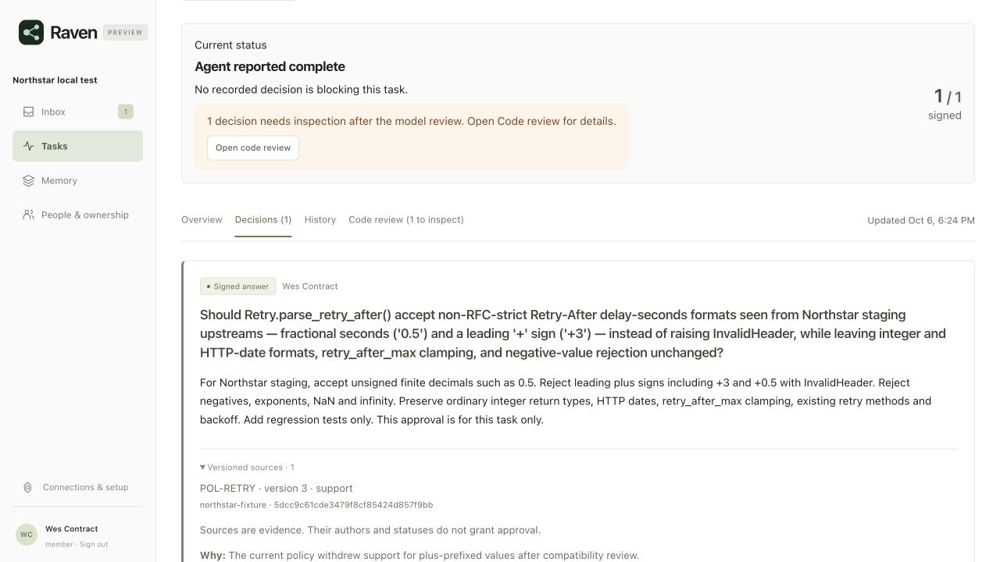

# Live source revalidation and customer installation, 6 October 2026

The source-change and approval loop held on `68b98b8840831a6f4206f11069c8e0953ce54fe2`.
Real Claude Code processes implemented both versions of a policy in urllib3
and read the saved reviews. The final version's proof matches its actual patch. The
final policy passes 88 upstream retry tests and seven independent contract tests.
This was a supervised success, not a seamless Slack-only customer experience.
The earlier version's saved diff has a host transcription error and does not apply
to the baseline; that stage fails the exact-patch gate despite passing native tests.
One cached answer could not be approved in Slack because its complete review
exceeded the chat limit. Completing the loop required a Raven account and the web UI.

The original coding attempt also exhausted the evaluator's turn budget after
receiving its first review. A fresh host recovered it. This report does not add
independent cold-start passes to the earlier breadth campaign.

## What was real

* Fresh checkout of the exact Raven commit, new Docker Compose project and
  volumes, production app image, PostgreSQL 17, and the documented `./setup`
  accountless setup path. The initial setup page was inspected in a browser.
  Provider and simulator settings were written through Raven's setup helper;
  this does not certify every interactive wizard prompt or cloud deployment.
* A fresh public clone of `urllib3/urllib3` at
  `a164d79c8cf760f222daa2dc7f67d0e1ca7fb17c`: 150 commits, 44 distinct author names,
  largest author share 36%. Real local history ingestion, not a fabricated git
  history. Identities were pseudonymized before inference and routing.
* Official Claude Code CLI 2.1.291 over Raven's authenticated HTTP MCP, with
  `claude-sonnet-5`. Raven used real Anthropic inference with its normal semantic
  and deep inference settings, Sonnet and `claude-haiku-4-5-20251001`.
* Human UI interactions through the in-app browser: the recipient task page,
  a note to the host, optional account creation, current-source review, a stale
  form refusal, and a fresh correction. No administrator approval override.
* Actual edits, upstream pytest runs, independently captured diffs, and a
  separate seven-group behavior oracle.

Slack users, messages and events were synthetic. A local HTTP service implemented
the Slack contract; Raven synced 49 members, sent messages, and received signed
Events API callbacks. Its natural-language replies were interpreted by the live
model. The service recorded 38 requests, 12 messages and zero contract violations.
Jira policy revisions were synthetic records submitted to `POST /api/records`.
No real contributor was contacted. No real Slack installation, Jira pull
connector or GitHub App/webhook was exercised. GitHub supplied the public clone.

## The loop and its results

| Step | Observation | Result and limit |
| --- | --- | --- |
| Install and ingest | New Docker/Postgres instance started; accountless setup indexed urllib3; browser reached the workspace. | Passed. Evaluation identity preparation initially failed on PostgreSQL; the helper fix below was necessary before live inference. |
| Discover the decision | The initial host received a short request about staging upstreams sending `Retry-After: 0.5` and `+3`. It inspected the checkout and registered the compatibility decision itself. | Passed on this one task. No owner, decision ID or changed source path was prescribed in the task. This is not a decision-coverage benchmark. |
| Find a first contact | Kickoff mentioned policy author Wes Contract, but the registered node went to Engineer b01026 from code history. | One scoped handoff was needed. The handoff explicitly said “just this one,” so no learned route was expected. |
| Ask and record judgment | A natural Slack referral received a readback; Wes then approved decimals and plus-prefixed values for this task only, after reviewing and confirming the bound source readback. | Passed. The answer retained source version 1. The readback was 6,531 characters and difficult to read. |
| Hold the gate | A finish attempt before human authorization was refused. An identical policy import reported no change and preserved authorization. | Passed. A source record's author/status did not itself grant approval. |
| Implement and inspect | The host implemented version 1, received the asynchronous review, and saw a real compatibility issue: ordinary integer input now returned a float. | Useful review finding. The first host hit its evaluator turn limit before repairing it. |
| Recover a fresh host | A new process recovered by client key, read the decision, note and review, restored integer return types, added type regression tests, finished again and exported the refreshed proof. | Code recovery passed with 93 upstream tests. Exact-patch gate failed: the submitted diff lost three context spaces and does not apply to the baseline. The final review remained `unclear` about unchanged methods/backoff. |
| Reuse on a new task | The evaluator created task B with the same question and facts through HTTP MCP. Raven returned the earlier answer from memory, with `authorized: false`. | Cache hit passed; fresh approval was still required. B's creation is a controlled probe, not a second autonomous discovery success. |
| Approve the cached answer in Slack | Wes's natural answer could not produce a confirmable readback because the complete source review exceeded 12,000 bytes. | Safely refused, but customer workflow failed. The only offered review path required an authenticated Raven account. |
| Change the source | Policy version 2 withdrew all plus-prefix support. Both dependent decisions lost current authorization; historical signatures remained; A's immutable proof became stale. B could not finish. | Passed. Reimporting source data did not silently rewrite a signed answer or its old proof. |
| Race a browser review | Wes opened the version 2 review. While the form was open, the evaluator imported a version 3 title clarification. The old form's correction was rejected. | Passed: “This decision changed while you were reviewing it.” There was no successful stale confirmation in Slack to test; Slack had refused to create that oversized review. |
| Reapprove current evidence | Wes reopened the decision, reviewed version 3, corrected the answer and checked the explicit source-review box. The independent-replacement option was left off. | Passed. Current authorization returned with version 3 pinned, retaining source dependence. |
| Restart and resume | The app container restarted. A fresh coding host recovered task B and its current answer, removed plus support and preserved fractional support. | Persistence/recovery passed. A pre-restart wait returned immediately, so this run does not establish in-flight wait interruption behavior. |
| Finish and export | B's host received the saved review, repeated finish to refresh the proof, and exported it. | 88 upstream tests and 7/7 independent groups passed. The proof's diff equals the workspace diff byte for byte; integrity and current-review checks pass. The advisory verdict is `unclear`, not verified. |
| Ask about history | Another fresh host, given no decision IDs, found both decisions and explained who changed the policy and why. | Read-only MCP lookup, no new task or ping. Policy and attribution were correct, but it called a creation timestamp the signing time. |

Task A is `3850d9c6dde9`, decision `fd8642fc9a10`. Task B is `27f7e97f3e2d`,
decision `653b31567c31`. Source record `POL-RETRY` is
`348020de08f642ecadb44145b3969760`. These are disposable evaluation identities.

## What would still disappoint a customer

### 1. A saved proof can contain a host-transcribed patch that does not apply

The recovered A host returned a proof whose diff differed from the independently
captured working-tree diff by three spaces on context lines in `test/test_retry.py`.
Applying both unchanged against the pinned baseline with separate temporary Git
indexes showed that the actual patch applies and the submitted patch fails. This
is not merely different diff formatting that produces the same Git tree.

Raven bound and retained the exact submitted text; the failure is the gap between
that text and the tested checkout. Its review did not report the malformed patch.
The host subsequently claimed the proof was current. A failed exact-patch gate
must not become a completed live acceptance result because the workspace tests pass.

Prefer an integration that submits `git diff` bytes directly, verifies its digest
against the checkout used for tests, and checks applicability where a base checkout
is available. Preserve the stated limit when Raven cannot observe that checkout.
The final B host did submit a byte-identical, applicable patch. Evidence:
`patch-v1-submitted.diff`, `patch-v1-final.diff`, `patch-application.json` and both
immutable proofs. The old proof has not been repaired or replaced for this report.

### 2. Cached approvals can require an account, breaking the Slack-first promise

This happened with just one reused decision, not an unusually large task tree.
`bridge/source_review.py` correctly refuses to truncate a complete source reading,
but its fallback links to an authenticated `/#runs/...` page. The recipient's
accountless task page has no equivalent complete source-revalidation action.
We created a synthetic recipient account and finished through the full app.

The next product change should provide a complete, recipient-scoped source review
on the existing task-link surface, with the same exact revision pins and race
checks. Raising the size cap or letting a short “yes” bypass source review would
not solve the underlying problem. Review the access boundary before shipping it.

Evidence: message `1700000000.000010` in the saved Slack transcript, the browser
stale-form capture, and the final corrected decision/proof.

### 3. Review payloads are technically explicit but burdensome to read

The first answer's readback was 6,531 characters. It repeated question/context,
scope and options and included raw source/dependency JSON. Normal code identifiers
arrived as `parse\u005fretry\u005fafter\u0028\u0029`. The escaping in
`bridge/approval_scope.py` prevents markup/mention interpretation but makes an
ordinary technical question look corrupted.

Keep complete, inspectable evidence and exact binding, but display identifiers
literally using transport-safe formatting. Present the human proposal first and
make the source details readable rather than repeating raw structures. Do not
hide changes behind a model-written summary that becomes the signed contract.

### 4. Known inherited provenance is labelled unknown

Before mutation, B had `sources: []` and `source_provenance: unknown`, with a
notice about unknown legacy citations. In the same response, `source_revalidation`
contained its dependency on A and A's known source revision. This was a new,
versioned cache hit, not an imported legacy answer.

The gate still tracked and invalidated the dependency correctly. The defect is
the explanation: `bridge/store.py` classifies provenance from direct edge presence
and makes trustworthy inherited evidence sound missing. Distinguish direct,
inherited and genuinely unknown provenance, and show the chain consistently.

Evidence: `cache-b-before-change.json`.

### 5. Contact choice still makes the requester or first recipient do coordination

The source text named Wes as the policy contact and kickoff surfaced him, but
the node selected a recent code contributor. The referral worked, including its
task-only restriction. Source prose must never grant approval authority, but it
can inform a contact suggestion with a clear reason. This run supports improving
first-contact ranking/explanations; it does not prove who has real business authority.

### 6. A cited history answer can still misstate an audit fact

The history host correctly recovered the withdrawn plus-prefix approval and the
current rejection, with the right decision IDs and Wes's attribution. It said
the old decision was signed around 01:02 UTC, its creation time; the stored
signature is 01:04:05 UTC. The history response should distinguish creation,
answer, signature and source-change times. Citation presence alone does not
establish faithful narration.

## Review latency and host recovery

The three completed advisory reviews took **139.4, 128.4 and 115.2 seconds** for
one decision each. The async mechanism worked: the hosts received the result and
could refresh the exported proof. The first review caught the integer-type issue;
the subsequent reviews retained uncertainty about behavior outside the changed
lines. Native and independent tests provided separate evidence, not a reason to
reinterpret an `unclear` model verdict as a pass.

| Host process | Recorded outcome | Turns | Approx. wall time |
| --- | --- | ---: | ---: |
| Initial A | Evaluator turn limit, after implementation and first review | 46 | 430 s |
| Fresh A recovery | Code/test recovery; finished with a malformed submitted patch | 20 | 242 s |
| Fresh B implementation | Finished current policy, refreshed proof | 24 | 245 s |
| Fresh history lookup | Answered, timestamp error noted above | 10 | 27 s |

The CLI reported about **$1.76** across these four processes. This excludes
Raven's own provider calls. Some shell attempts were denied by the intentionally
narrow host harness; those denials and the evaluator turn budget are not counted
as Raven runtime defects. The final B patch SHA-256 is
`8476a8c3570cf8f16cda7fab39538f71ad68c16beabeead5e8f49db1c99a65b0`.

## Evaluation preparation fix

The old `evals/pseudonyms.py` tried to reinsert PostgreSQL's generated
`search_vector` column, preventing this fresh evaluation from reaching inference.
Deleting/reinserting ID rows also risked damaging source references, and source
version snapshots were not pseudonymized.

The helper now updates ID rows in place, leaves generated search columns to the
database, and scrubs source snapshots with matching fingerprints while preserving
their IDs. It refuses graphs that already contain decisions: this is fixture
preparation, not a way to rewrite customer audit history. Added regressions cover
preserved source versions/search, stable repeat application and refusal after a
decision exists. They are registered in the PostgreSQL suite.

Focused validation: **6/6 SQLite and 6/6 PostgreSQL** helper tests passed.
The original helper reproduced PostgreSQL failures before applying the fix.
The production runtime in the live loop remained **68b98b8**; no product source
fix was applied to obtain these results.

The context-memory browser suite separately passed its nine recorded checks,
including complete current-source display, explicit bound revalidation and stale
form refusal. A two-call real-provider smoke check also passed. The earlier
agent's 2,815 image tests, 497 PostgreSQL tests and eight browser/DOM suites were
not rerun and are not this report's results.

## Evidence and limits

Sanitized [evidence](../evals/results/live-source-loop-2026-10-06/README.md) includes
host MCP exchanges and summaries, simulated Slack messages, source revisions,
HTTP probe results, immutable proofs, both patches, test logs and screenshots.
Host private reasoning and non-MCP file-read outputs are excluded. Provider
credentials and local bearer links are not included. Proof objects were copied
unchanged; the export checks that sanitization did not modify their bytes.

The previously service-blocked required-signer/independent signer-identity review
remains unresolved and was not attempted here. The excluded complex multi-repo
recovery was not resumed. This run does not certify real employee authority,
real external installations, audio input, cloud/TLS operation, broad task
discovery, semantic review reliability, or production readiness. It demonstrates
one supervised source/cache/reapproval workflow, including its failure and
manual recovery points, on a real public codebase.

